## Make a new Repl evironment

### Go to https://repl.it/


### Under language select Bash and name it `jokes-bot`


### In the terminal make a new python file using the `touch` command 


### Write the following code in the new python file

```python
import requests

URL = 'https://official-joke-api.appspot.com/random_joke'


def check_valid_status_code(request):
    if request.status_code == 200:
        return request.json()

    return False


def get_joke():
    request = requests.get(URL)
    data = check_valid_status_code(request)

    return data
  
print(get_joke())
```

- Run the code with `python main.py`
  - What happens? 


```javascript
{
    'id': 25,
    'type': 'programming', 
    'setup': 'How many programmers does it take to change a lightbulb?',
    'punchline': "None that's a hardware problem"
}
```


# Setting up a Discord server

### Make your own discord server

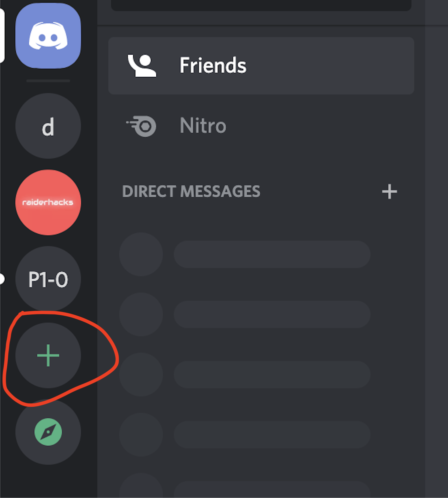

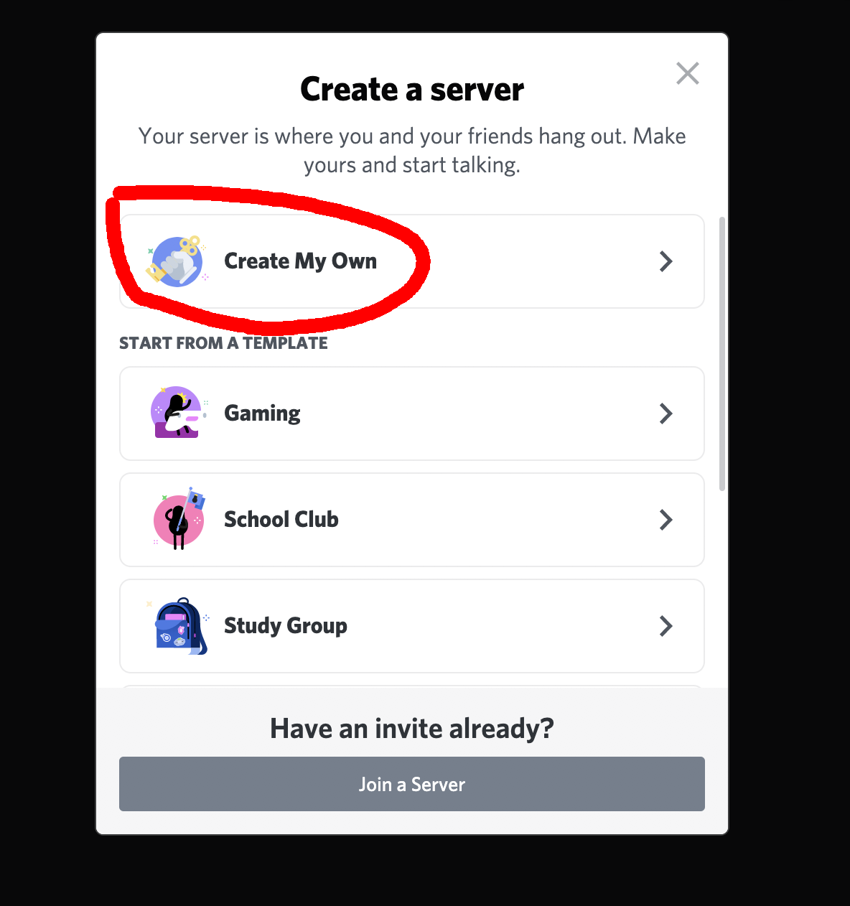

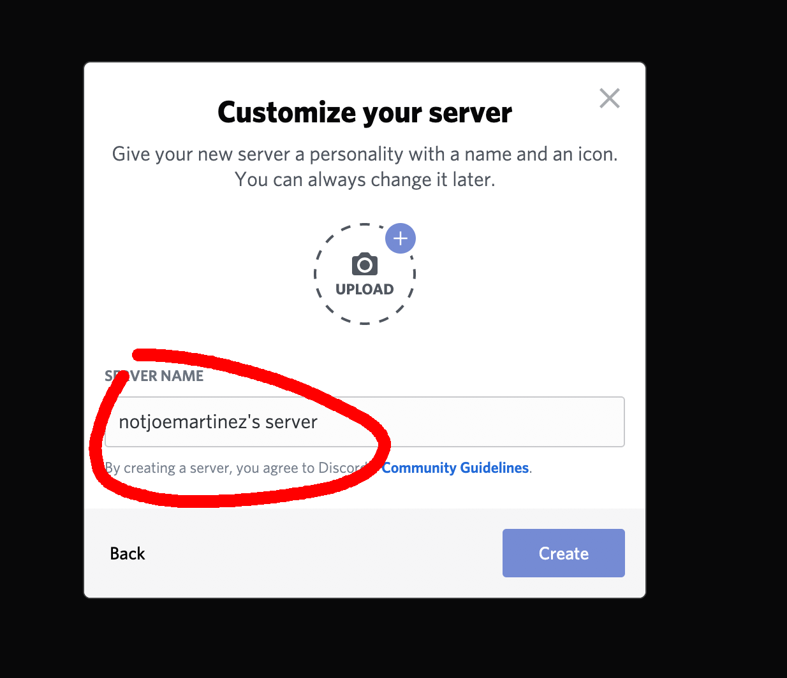

## Sign into https://discord.com/developers/applications

### Click on `New Application`

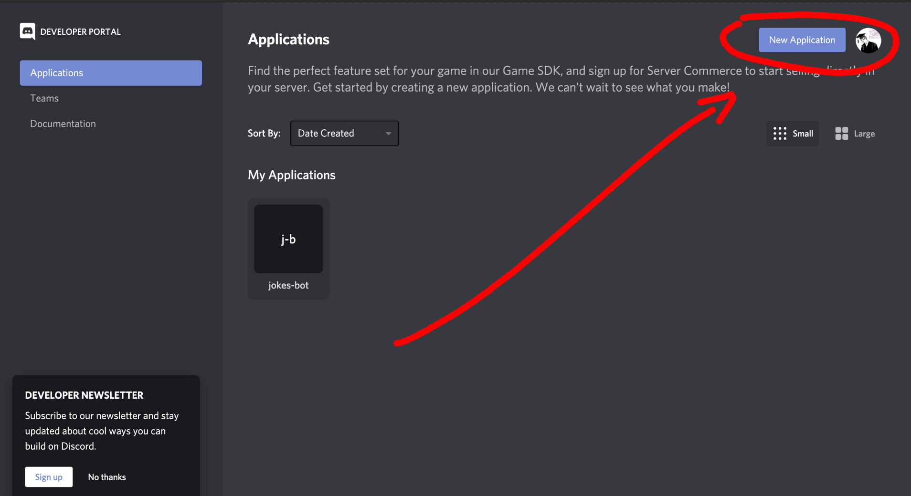

### Give your bot a name 

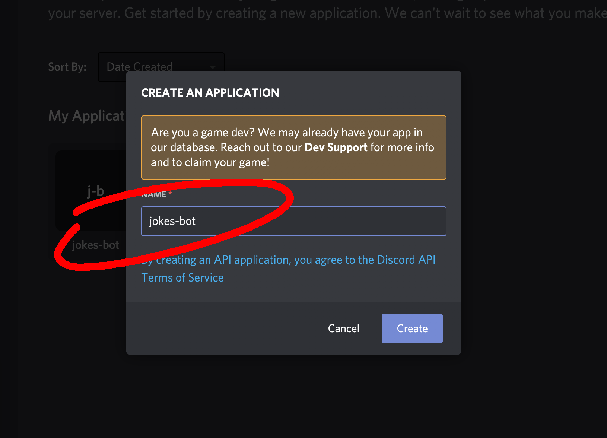

### Under `Settings > Bot > Authorization Flow` Make sure the `PUBLIC BOT` option is enabled and the `REQUIRES OAUTH2 CODE GRANT` option is disabled

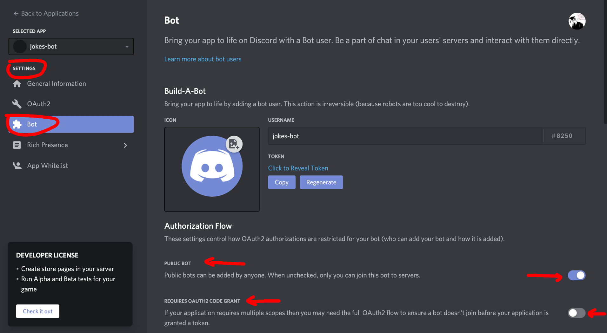

### Under the settings tab navigate to `OAuth2 > Scopes`

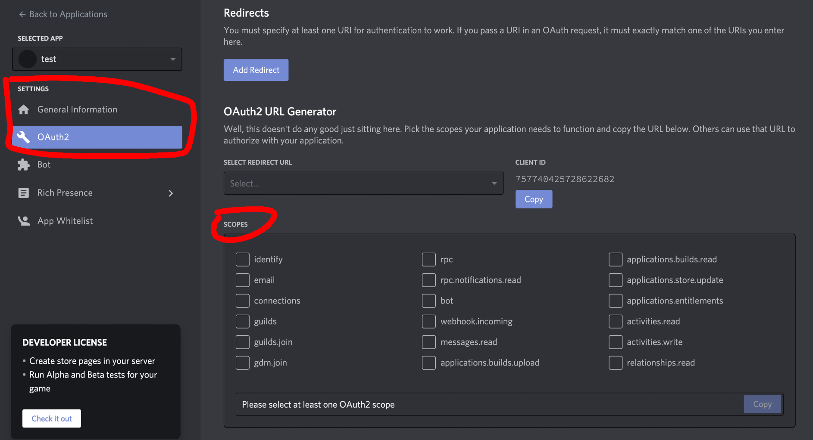

### Under Scopes select `Bot` then you will see a new section named `BOT PERMISSIONS` under that section select `Administrator`

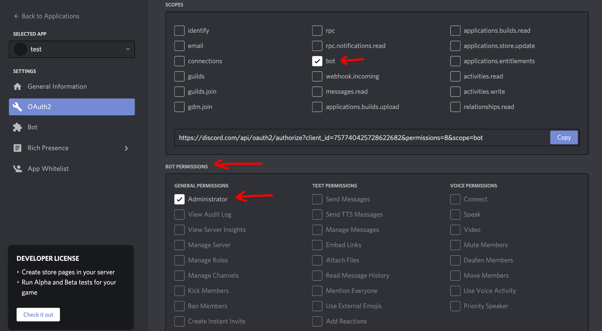

### Now copy the link under scopes and paste it into a new browser window 

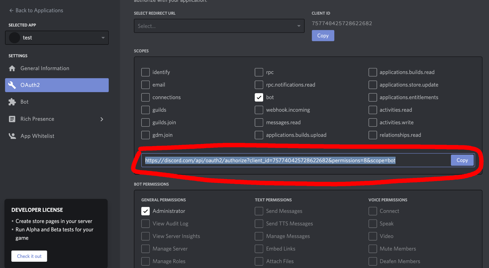

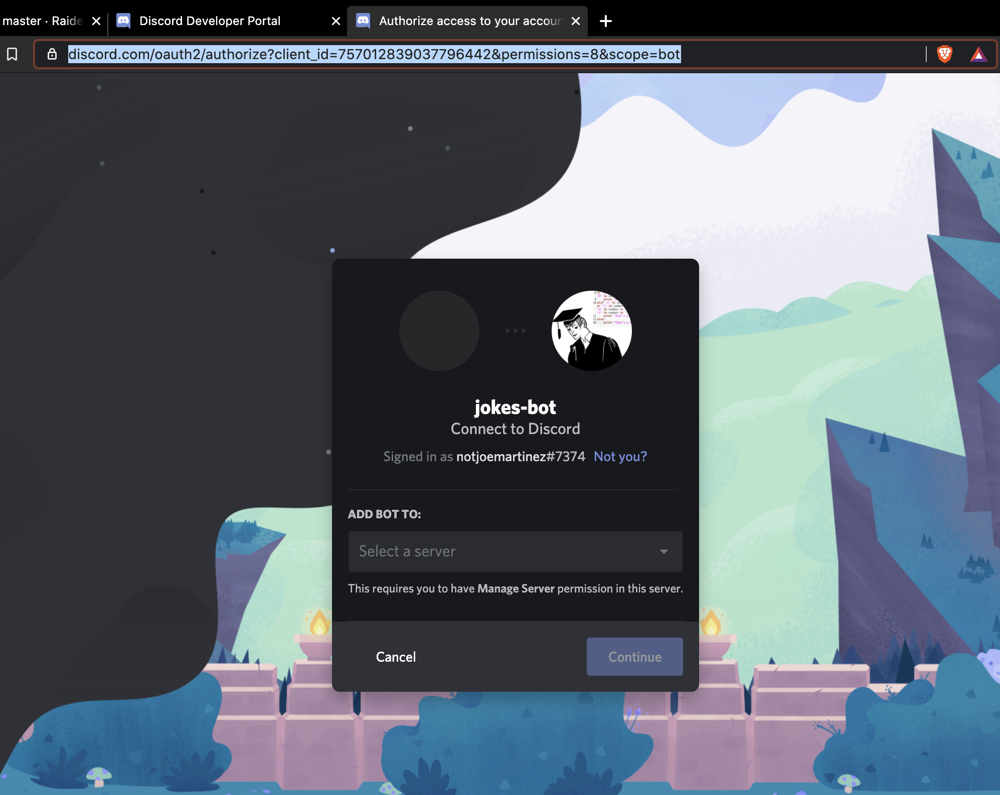

### Select the server we set up earlier & click `Authorize` on the next window

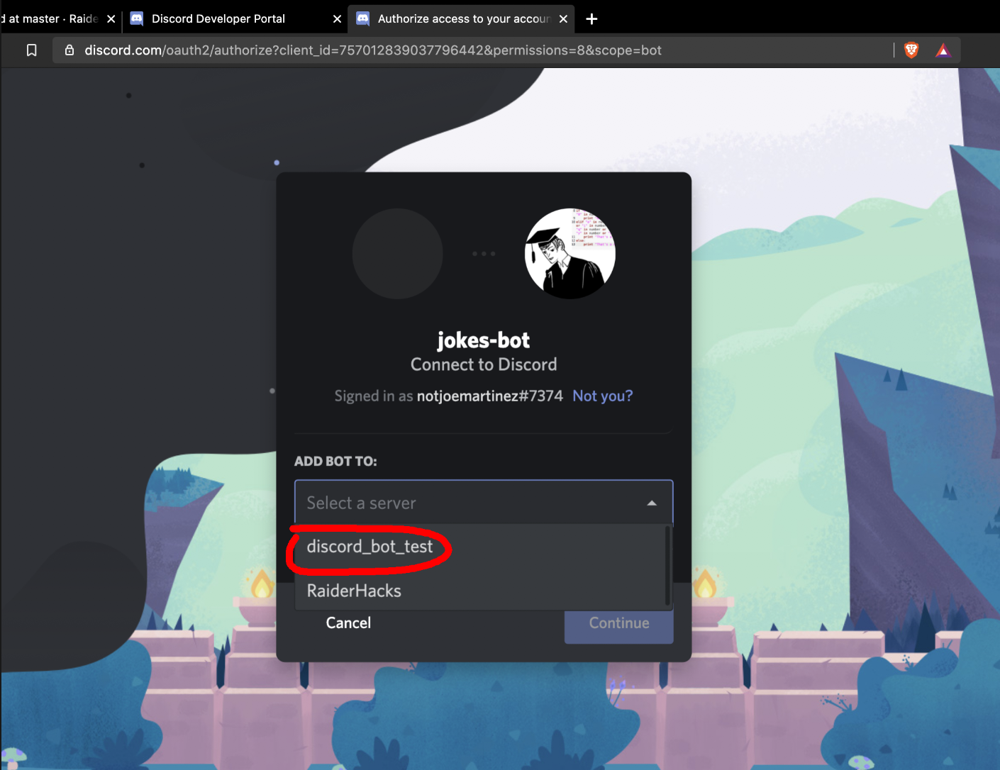

