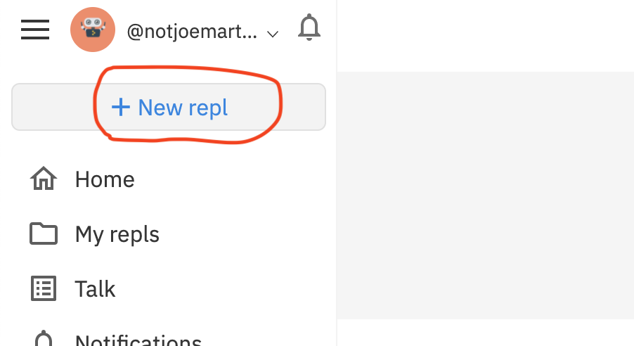
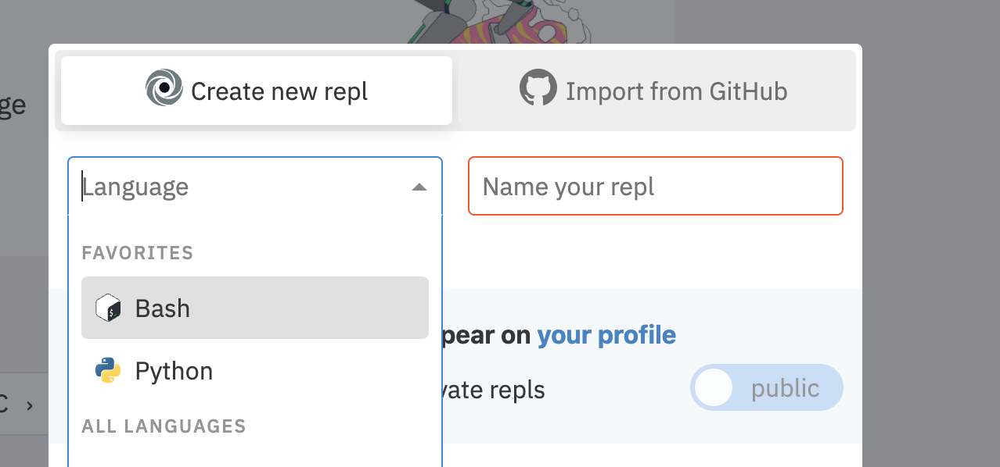
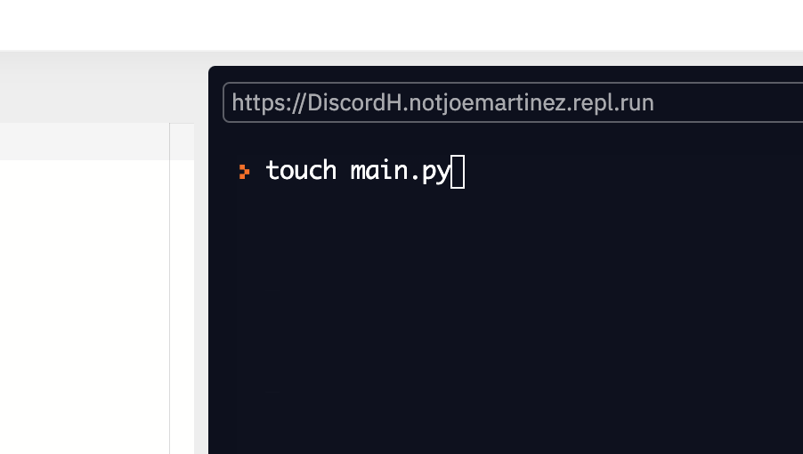

###  Make a new Repel evironment

- Go to https://repl.it/



- Under language select Bash and name it `jokes-bot`



- In the terminal make a new python file using the `touch` command 




### Write the following code in the new python file

```python
import requests

URL = 'https://official-joke-api.appspot.com/random_joke'


def check_valid_status_code(request):
    if request.status_code == 200:
        return request.json()

    return False


def get_joke():
    request = requests.get(URL)
    data = check_valid_status_code(request)

    return data
  
print(get_joke())
```

- Run the code with `python main.py`
  - What happens? 


```json
{
    'id': 25,
    'type': 'programming', 
    'setup': 'How many programmers does it take to change a lightbulb?',
    'punchline': "None that's a hardware problem"
}
```


1. 0https://discordpy.readthedocs.io/en/latest/discord.html

1. https://discord.com/developers/applications
   1. New application 
   2. Name it "jokes bot "
   3. 
