# Part 1: calling the jokes API

### Make a new 

 environment, Go to https://repl.it/


### Under language select Bash and name it `jokes-bot`

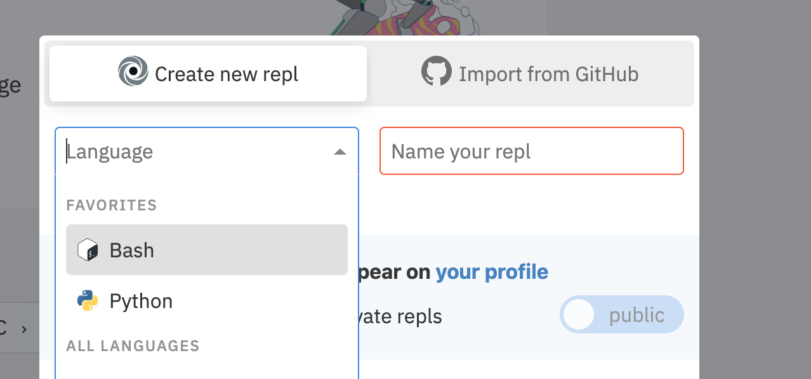

### In the terminal make a new python file using the `touch` command 


### Write the following code in the new python file

```python
import requests

URL = 'https://official-joke-api.appspot.com/random_joke'


def check_valid_status_code(request):
    if request.status_code == 200:
        return request.json()

    return False


def get_joke():
    request = requests.get(URL)
    data = check_valid_status_code(request)

    return data
  
print(get_joke())
```

- Run the code with `python main.py`
  - What happens? 


```javascript
{
    'id': 25,
    'type': 'programming', 
    'setup': 'How many programmers does it take to change a lightbulb?',
    'punchline': "None that's a hardware problem"
}
```


# Part2: Setting up a Discord server & Bot 

### Make your own discord server

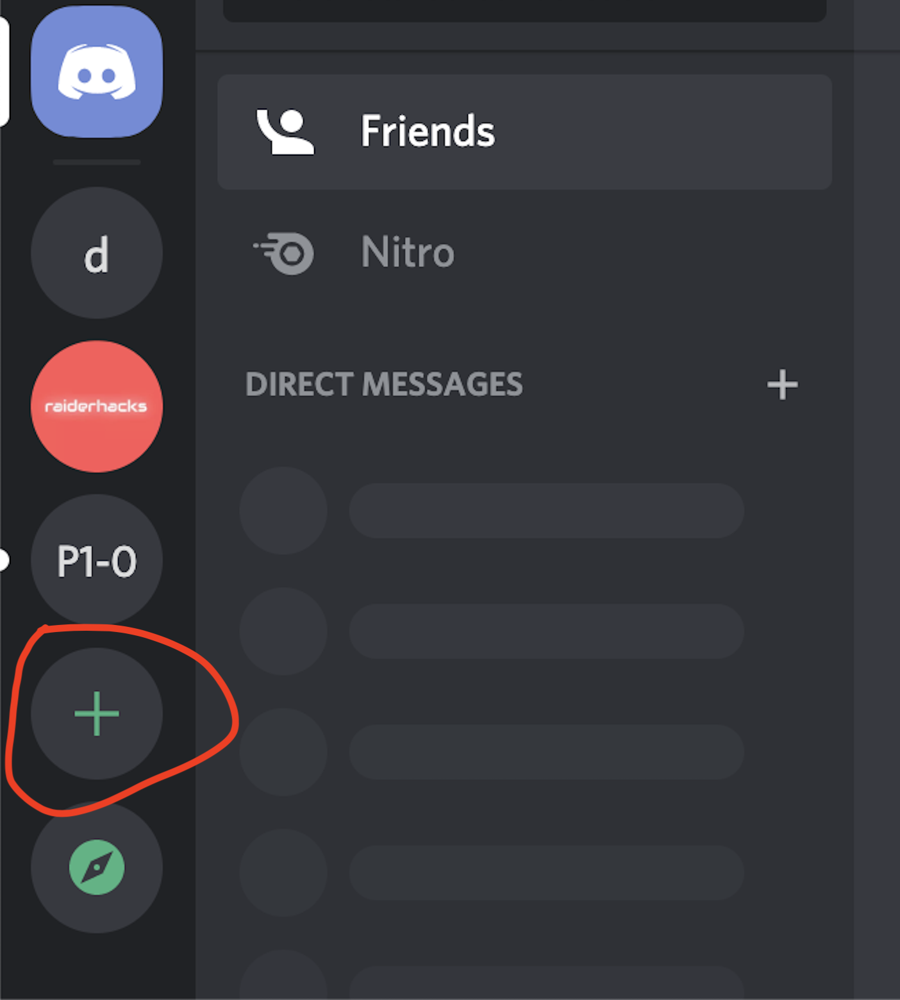

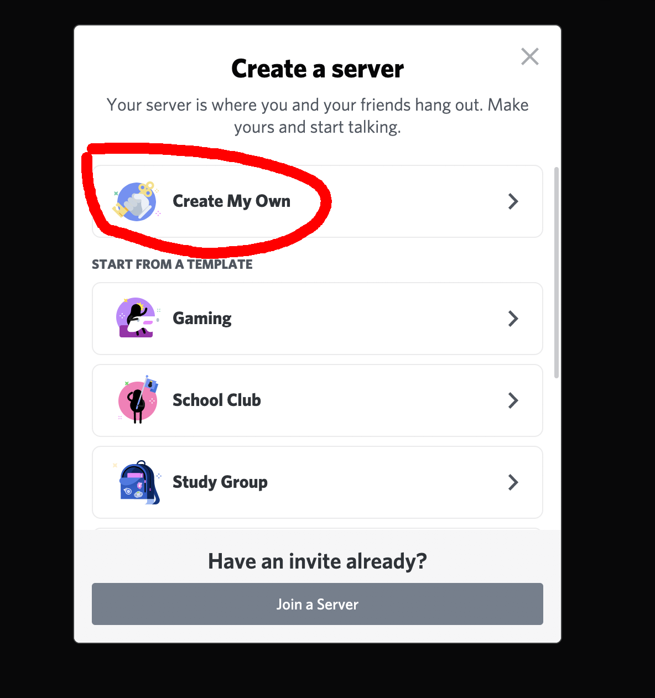

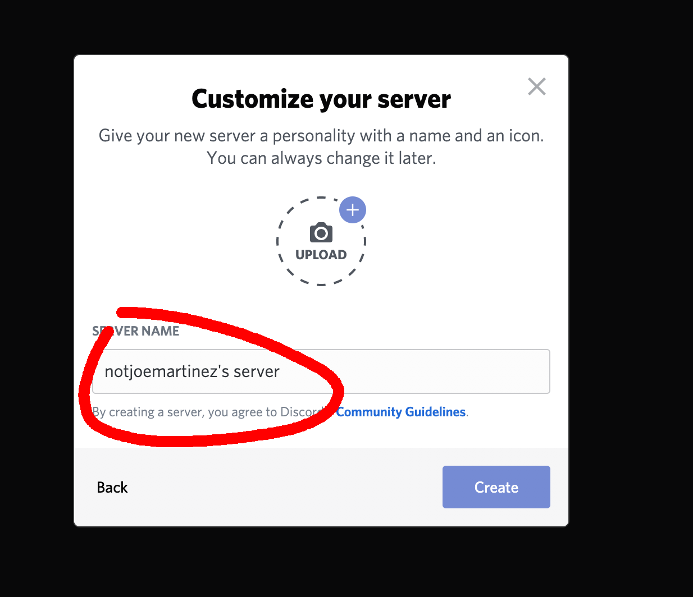

## Sign into https://discord.com/developers/applications

### Click on `New Application`


### Give your bot a name 

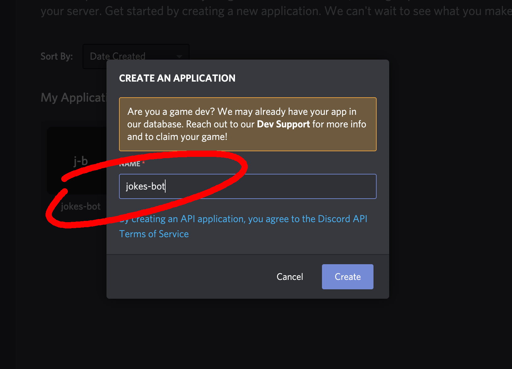

### Under `Settings > Bot > Authorization Flow` Make sure the `PUBLIC BOT` option is enabled and the `REQUIRES OAUTH2 CODE GRANT` option is disabled

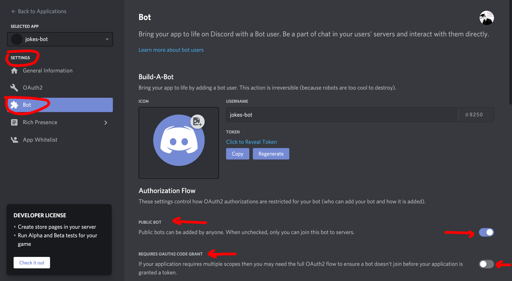

### Under the settings tab navigate to `OAuth2 > Scopes`

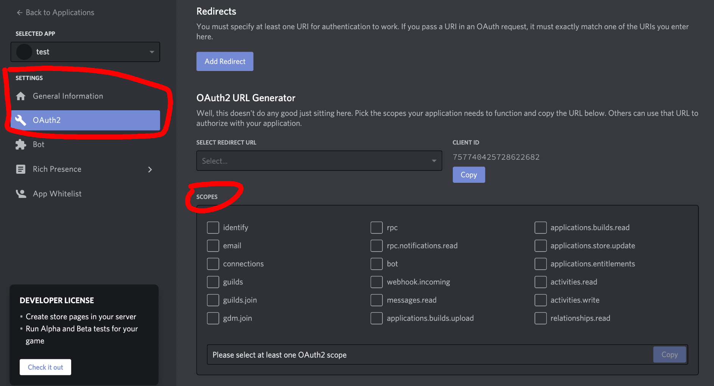

### Under Scopes select `Bot` then you will see a new section named `BOT PERMISSIONS` under that section select `Administrator`

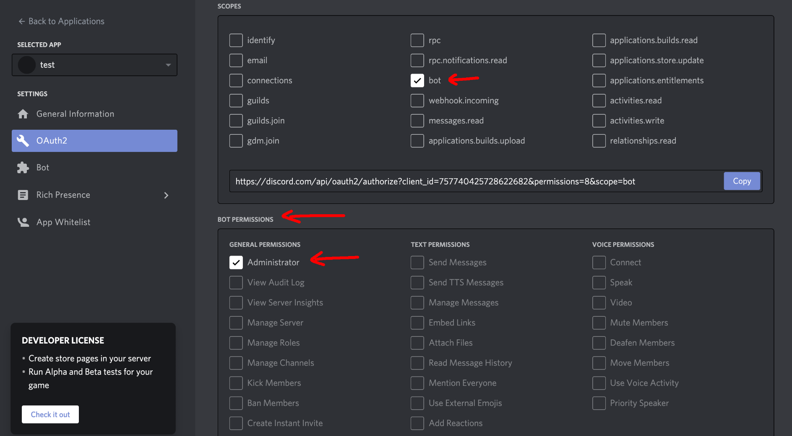

### Now copy the link under scopes and paste it into a new browser window 

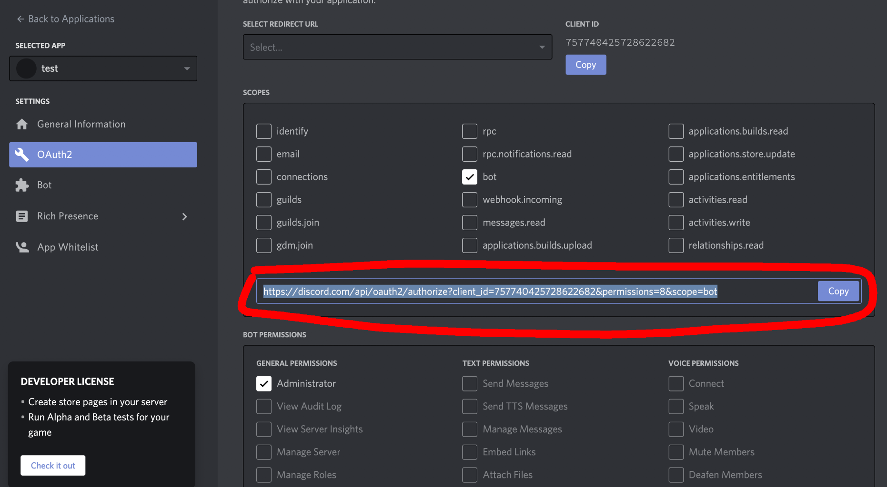

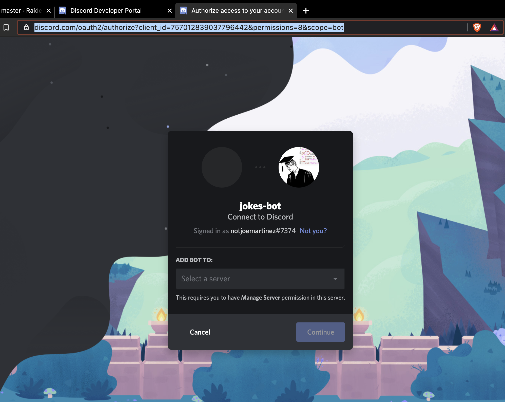

### Select the server we set up earlier & click `Authorize` on the next window


# Part 3: Interacting with your bot

### Go back to your [Repl environment](https://repl.it/) and install the discord and requests modules

```
pip install discord
pip install requests
```

 ### Create a new python file named `bot.py`

`touch bot.py`

### Now paste this code into `bot.py`

##### On line 19 of the previous snippet notice `client.run('your_bot_token')	`

```python
import discord

client = discord.Client()


@client.event
async def on_ready():
    print('We have logged in as {0.user}'.format(client))


@client.event
async def on_message(message):
    if message.author == client.user:
        return

    if message.content.startswith('$hello'):
        await message.channel.send('Hello!')

client.run('your_bot_token')	
```


### Navigate back to https://discord.com/developers/applications `Settings > Bot > Build-A-Bot` and select copy under `TOKEN`

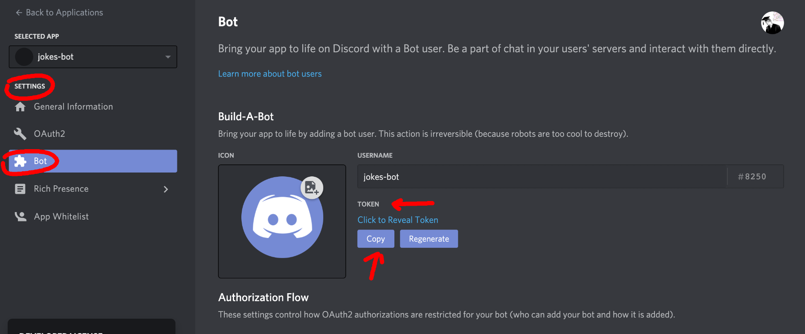

### Navigate back to https://repl.it and replace the string on line 19 with your token

**It will look something like this**

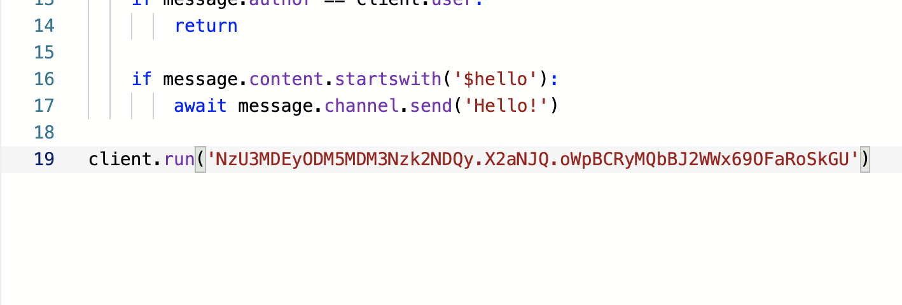

#### In your console run `python bot.py`. Don't exit this

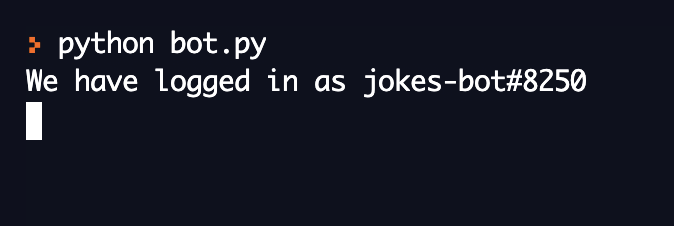

#### In your discord server type `$hello` to interact with your bot

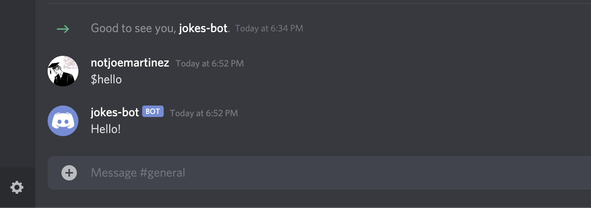

